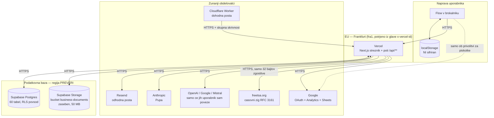
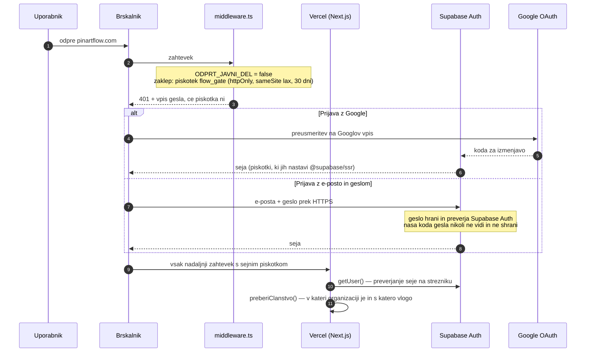
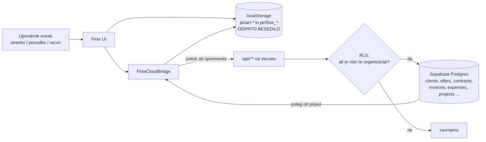
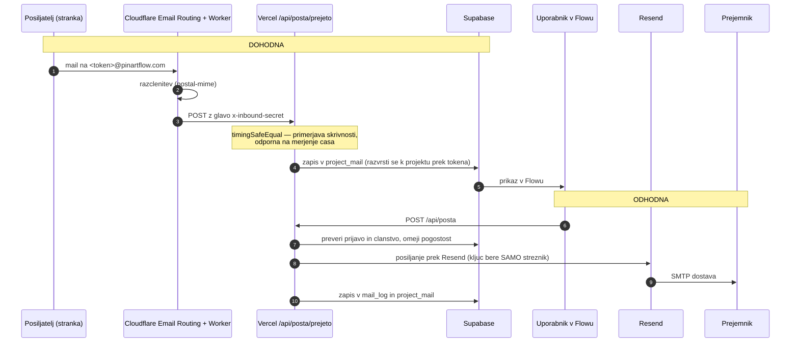
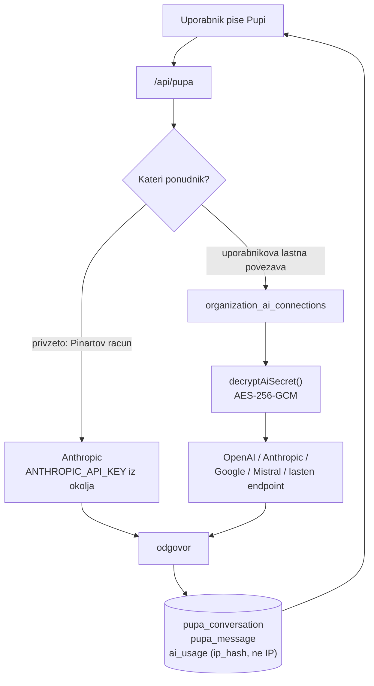
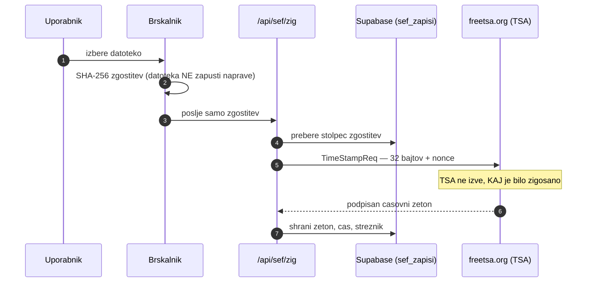
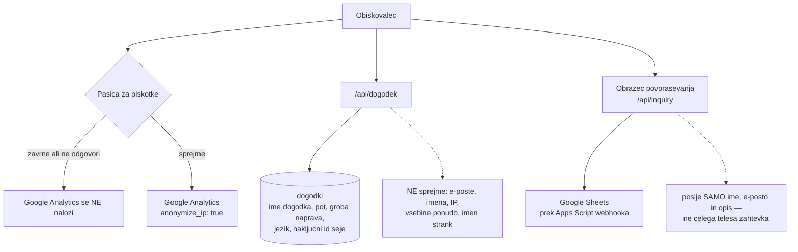
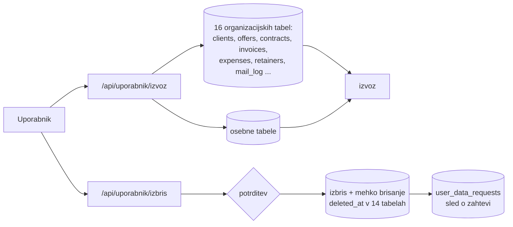

# Pinart Flow — tok podatkov in sifriranje

Namen: en dokument, ki odvetniku (in nam) pokaze, KATERI podatki tecejo KAM,
KDO jih hrani in KAKO so zavarovani.

Stanje: 22. 8. 2026, veja `demo`, commit 8b0233b. Vse trditve so prebrane iz kode,
ne iz spomina. Kjer nekaj ni bilo mogoce preveriti iz kode, pise **PREVERI**.

---

## Diagrami (SVG)

Za odvetnika in za tisk uporabi te. Odprejo se v brskalniku, Preview, Illustratorju
ali Figmi; besedilo je pravo besedilo, ne krivulje, zato je iskljivo in popravljivo.

| | Datoteka | Kaj pokaze |
|---|---|---|
| 01 | [diagrami/01-strezniki.svg](diagrami/01-strezniki.svg) | Kdo poganja kateri del sistema in v kateri jurisdikciji |
| 02 | [diagrami/02-tok-podatkov.svg](diagrami/02-tok-podatkov.svg) | Stranka, ponudba, racun — zapis na dve mesti hkrati |
| 03 | [diagrami/03-posta.svg](diagrami/03-posta.svg) | Dohodna in odhodna posta, odsek za odsekom |
| 04 | [diagrami/04-sifriranje.svg](diagrami/04-sifriranje.svg) | Sifriranje v prenosu, v mirovanju in v aplikaciji |
| 05 | [diagrami/05-ai-in-sef.svg](diagrami/05-ai-in-sef.svg) | Kaj zapusti sistem: AI proti Sefu avtorstva |

Mermaid razlicice spodaj so isti tok v besedilni obliki — uporabne za urejanje
in za pregled na GitHubu, a za odvetnika posljemo SVG.

---

## 1. Zemljevid sistema — kdo hrani kaj in kje

Kaj je iz tega pomembno za odvetnika:

- Streznik tece v Frankfurtu (EU). Regija baze **PREVERI** — to je tvoja naloga.
- Vsi prenosi gredo prek HTTPS. Nobena pot ne dovoli `http://`.
- Cloudflare, freetsa.org, OpenAI in Mistral **niso** navedeni v politiki
  zasebnosti. Glej razdelek 11.

---

## 2. Prijava in seja

Podatki, ki nastanejo: e-posta, ime iz Google profila, id uporabnika,
cas prijave. Gesla v nasi bazi ni.

---

## 3. Poslovni podatki — stranka, ponudba, pogodba, racun

To je jedro. Pomembna posebnost: podatki se pisejo **na dve mesti hkrati** —
v brskalnik in v oblak.

Kaj se zapise: ime in priimek ali naziv stranke, naslov, davcna in maticna
stevilka, e-posta, telefon, vsebina ponudb in pogodb, zneski, roki, opombe.
Torej **osebni podatki strank nasih uporabnikov** — Flow je pri teh podatkih
obdelovalec, uporabnik pa upravljavec.

Locitev med organizacijami je izvedena z RLS politikami na vseh 60 tabelah.
Preverjeno: vsaka tabela ima `enable row level security`.

Odprta tocka: `localStorage` je odprto besedilo. Glej razdelek 10.

---

## 4. Posta — dohodna in odhodna

Pomembno: vsebina mailov je v bazi shranjena v **berljivi obliki** (da je
iskanje in prikaz sploh mogoc). Med Resendom in strezniki prejemnikov velja
navadna SMTP dostava — sifriranje je oportunisticno (STARTTLS), ne zajamceno
od konca do konca. To sodi v politiko zasebnosti kot izrecna omejitev.

---

## 5. AI — Pupa in lastna povezava uporabnika

Kaj gre ponudniku AI: vprasanje uporabnika in kontekst, ki ga Pupa dobi —
torej lahko tudi imena strank in vsebina dokumentov. To je prenos v tretjo
drzavo in mora biti v politiki zasebnosti pojasnjeno (Anthropic ze je).

Kljuci uporabnikovih lastnih AI povezav so **edini podatek v celem sistemu,
ki ga sifriramo mi sami** — AES-256-GCM, kljuc `AI_CREDENTIALS_ENCRYPTION_KEY`
(32 bajtov), zapis oblike `v1.<iv>.<tag>.<sifropis>`. V UI se kljuc nikoli ne
vrne — samo maska `••••1234`.

---

## 6. Sef avtorstva — overjen casovni zig

To je z vidika varstva podatkov najcistejsi tok v sistemu: navzven ne gre
noben osebni podatek, samo 32 bajtov zgostitve. Koda tudi zavrne vsak
`TSA_URL`, ki ni `https://`.

**Napaka, ki jo je treba popraviti pred odvetnikom:** politika zasebnosti
(`app/[locale]/zasebnost/page.tsx`) navaja OpenTimestamps in Bitcoin,
koda pa uporablja RFC 3161 proti freetsa.org (`lib/casovniZig.ts:28`).

---

## 7. Obiskovalec brez racuna — analitika, piskotki, povprasevanje

Google Analytics se nalozi sele po privolitvi (`components/GoogleAnalytics.tsx`
preveri `pinart_cookie_consent`). To je pravilno.

Obrazec povprasevanja pise v **Google Sheets**. Ta obdelovalec v politiki
zasebnosti ni izrecno naveden kot prejemnik povprasevanj.

---

## 8. Izvoz in izbris podatkov (clena 15 in 17 GDPR)

Obe poti obstajata in delujeta. Pri izbrisu je treba odvetniku pojasniti
razliko med mehkim brisanjem (`deleted_at`) in dokoncnim izbrisom ter navesti
rok, po katerem mehko izbrisano izgine zares. **Tega roka danes nikjer ni
zapisanega** — ne v kodi ne v politiki.

---

## 9. Sifriranje — kaj je in kaj ni

### V prenosu (v gibanju)

| Odsek | Stanje |
|---|---|
| Brskalnik → Vercel | HTTPS/TLS. HSTS `max-age=63072000` potrjen s `curl -I` |
| Vercel → Supabase | HTTPS |
| Vercel → Resend | HTTPS (`api.resend.com`) |
| Cloudflare Worker → Vercel | HTTPS + skupna skrivnost, primerjana s `timingSafeEqual` |
| Vercel → Anthropic / OpenAI / Google / Mistral | HTTPS |
| Vercel → freetsa.org | HTTPS, koda zavrne `http://` |
| Resend → streznik prejemnika | **oportunisticni STARTTLS, ne zajamceno** |

### V mirovanju

| Kje | Stanje |
|---|---|
| Supabase Postgres | sifriranje diska na strani ponudnika — **PREVERI in zapisi v DPA** |
| Supabase Storage (`business-documents`) | zaseben bucket (`public = false`), dostop samo prek podpisanih URL-jev z rokom |
| Vercel | ne hrani uporabnikovih podatkov trajno; ostanejo dnevniki |
| **localStorage v brskalniku** | **NI sifriran — odprto besedilo** |

### Sifriranje, ki ga izvajamo mi sami

Eno samo mesto:

- `lib/aiConnections.ts` — AES-256-GCM za kljuce AI povezav.

Vse ostalo, kar je videti kot sifriranje, je **enosmerna zgostitev** (hash),
kar je za te namene pravilno, a ni sifriranje:

| Kaj | Kako | Datoteka |
|---|---|---|
| API kljuci | SHA-256, shrani se samo zgostitev | `lib/apiKljuc.ts` |
| Zetoni portala za stranko | 32 nakljucnih bajtov, shrani se SHA-256 | `lib/portalZeton.ts` |
| Zetoni za podpis pogodbe | 32 nakljucnih bajtov, shrani se SHA-256 | `lib/podpisPogodbe.ts` |
| Vsebina pogodbe (dokaz nespremenjenosti) | SHA-256 | `lib/podpisPogodbe.ts` |
| IP naslovi za omejevanje pogostosti | SHA-256 s soljo | `lib/rate-limit.ts` |
| Datoteke v Sefu | SHA-256 | brskalnik + `lib/casovniZig.ts` |

Gesla: hrani in preverja jih Supabase Auth. Nasa koda gesla nikoli ne vidi.

---

## 10. Kar je treba popraviti — po nujnosti

**1. localStorage ni sifriran in ostaja na napravi**
Poslovni podatki (stranke, ponudbe, racuni, stroski) so v odprtem besedilu v
brskalniku pod predponama `pinart-` in `pinflow_`. Kdorkoli ima dostop do
naprave ali brskalniskega profila, jih prebere. Za launch je najmanjsa
sprejemljiva resitev: to izrecno napisati v politiko zasebnosti in v pogoje,
in poskrbeti, da se ob odjavi obe predponi zares pobriseta.

**2. Manjkajoce varnostne glave**
`next.config.mjs` nima `headers()`. Danes ni ne CSP, ne `Referrer-Policy`,
ne `Permissions-Policy`, ne `X-Frame-Options` na lastni domeni. HSTS doda
Vercel sam. Popravek je kratek in ne posega v videz.

**3. `contract_signatures.ip_address` hrani surov IP**
Vse ostale poti IP zgostijo, ta ga hrani v celoti (`inet`). Za dokaz o
podpisu je to obicajno in verjetno branljivo, a mora biti v politiki
zasebnosti navedeno skupaj z rokom hrambe.

**4. Nepopoln seznam obdelovalcev v politiki zasebnosti**
Navedeni so Google, Anthropic, Supabase, Vercel in Resend.
Manjkajo: **Cloudflare** (dohodna posta), **freetsa.org** (casovni zig),
**Google Sheets** kot prejemnik povprasevanj, ter **OpenAI, Google in
Mistral** za primer, ko uporabnik poveze svojega ponudnika AI.

**5. OpenTimestamps / Bitcoin v politiki zasebnosti**
Ze znano. Koda uporablja RFC 3161 proti freetsa.org.

**6. Rok hrambe ni zapisan nikjer**
Ne v kodi, ne v politiki. Odvetnik ga bo zahteval za vsako kategorijo
podatkov posebej.

**7. Sol za zgoscevanje IP-jev**
V `app/api/povprasevanje/[slug]/route.ts:14` se ob odsotnosti
`API_RATE_LIMIT_SALT` uporabi `SUPABASE_SERVICE_ROLE_KEY` kot sol. Ni uhajanja
(zgostitev je enosmerna), a se je bolje izogniti temu, da isti niz sluzi kot
dostopni kljuc do baze in kot kriptografska sol. Nastavi `API_RATE_LIMIT_SALT`.

---

## 11. Vprasanja za odvetnika, ki izhajajo iz teh diagramov

1. Ali je za `localStorage` na uporabnikovi napravi potrebna posebna
   informacija ali privolitev, ker gre za podatke o **tretjih osebah**
   (strankah uporabnika), ne le o uporabniku samem?
2. Kaksen rok hrambe naj zapisemo za: vsebino mailov, dokaz o podpisu z IP
   naslovom, mehko izbrisane zapise, dnevnike?
3. Pogodba o obdelavi z nasimi uporabniki (Flow kot obdelovalec za podatke
   njihovih strank) — ali jo pripravimo kot prilogo k pogojem uporabe?
4. Ali zadosca, da AI ponudnike nastejemo genericno, ali mora biti vsak
   posebej naveden z drzavo in pravno podlago za prenos?

---

Zadnja sprememba: 22. 8. 2026.
Ob spremembi toka podatkov posodobi tudi ta dokument — odvetnik bo delal po njem.
